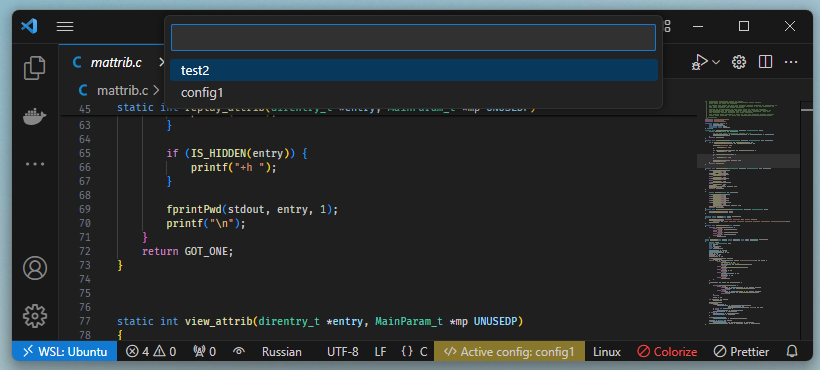

# Makefile to C/C++ config

Генератор конфигураций для C/C++ for Visual Studio Code.

## Принцип работы

Что бы было понятно как работать и как устранять проблемы.

1. Из параметра `make-to-cpp-props.generator.toolchainPath` берется имя тулчейна, например `arm-none-eabi-gcc`
2. На основе имени тулчейна создается "ловушка"
3. При генерировании конфига вызывается команд `make`, а путь к пустышке добавляется в начало перечислений переменной среды `PATH`. Тем самым "ловушка" подменяет собой реальный тулчейна и собирает параметры командной строки с которыми вызван тулчейн.
4. Собранные данные анализируются регулярными выражениями и заполняется структура файла конфига.
5. Если конфиг с таким именем уже существует, то он обновляется, если нет - создается.

Исходный код "Ловушки"

```c
#include <stdio.h>
#include <stdlib.h>
#include <string.h>
static char version[ 64 ] = "10.1.0";
int main(int argc, char *argv[])
{
    FILE *fv = fopen("version.cfg", "r");
    if (fv)
    {
        fgets(version, sizeof(version), fv);
        fclose(fv);
    }
    char * string = malloc(2*1024*1024);
    char * str = string;
    for (int i = 0; i < argc; i++)
    {
        if (strncmp(argv[ i ], "--version", 10) == 0) { printf("%s (%s) %s\n", argv[ 0 ], version, version); }
        size_t len = sprintf(str, "%s ", argv[ i ]);
        str += len;
    }
    printf("%s\n", string);
    free(string);
    return 0;
}
```


## Настройка

### Параметры генератора

```json
"make-to-cpp-props.generator.toolchainVersion": "10.0.1",
"make-to-cpp-props.generator.toolchainPath": "arm-none-eabi-gcc",
"make-to-cpp-props.generator.make": "make clean && make all -j",
"make-to-cpp-props.generator.CompilerPath": "/path/to/gcc/bin/arm-none-eabi-gcc",
"make-to-cpp-props.generator.env.path": {
    "linux": [
        "/path/to/1",
        "/path/to/2"
    ],
    "windows": [
        "c:/path/to/1",
        "c:/path/to/2"
    ]
},
```

### Настройка в качестве провайдера intellisens

Это необходимо для нормальной работы в мультирут воркспейсах

```json
"C_Cpp.default.configurationProvider": "ZaikinDenis.make-to-cpp-props",
```



## Использование

1. Установить и настроить
1. Вызвать контекстное меню на папке в которой лежит целевой Makefile. Поддерживаются стандартные имена "GNUmakefile", "makefile", "Makefile" и файлы ".mk"
1. Запустить команду генерирования и дождаться выполнения.

В файле настроек появятся два параметра:
* Имя теккущей конфигурации
* Описание конфигураций

```json
"make-to-cpp-props.configurations": [
    {
        "name": "config2",
        "includePath": [
            "workspace/config2/../../../../lib/drivers",
            "workspace/config2/../../../../lib/middleware",\
        ],
        "defines": [
            "NDEBUG",
            "FIRMWARE_VERSION_MAJOR=0x0333333",\
        ],
        "cStandard": "c23"
    },
    {
        "name": "config1",
        "includePath": [
            "workspace/config1/../../../../lib/drivers",
            "workspace/config1/../../../../lib/middleware",
            "workspace/config1/../../../../lib/sys",\
        ],
        "defines": [
            "FIRMWARE_VERSION_MAJOR=0x0333333",
        ],
        "cStandard": "c23"
    }
],
"make-to-cpp-props.activeConfigName": "config2",
```

## Существующие проблемы

1. Регулярки (не специалист в них, буду рад помощи)

## Планы

1. Вынести информацию о конфигурациях сборки в отдельные файлы. 
1. Вынести текущую конфигурацию из настроек в отдельное локальное хранилище.